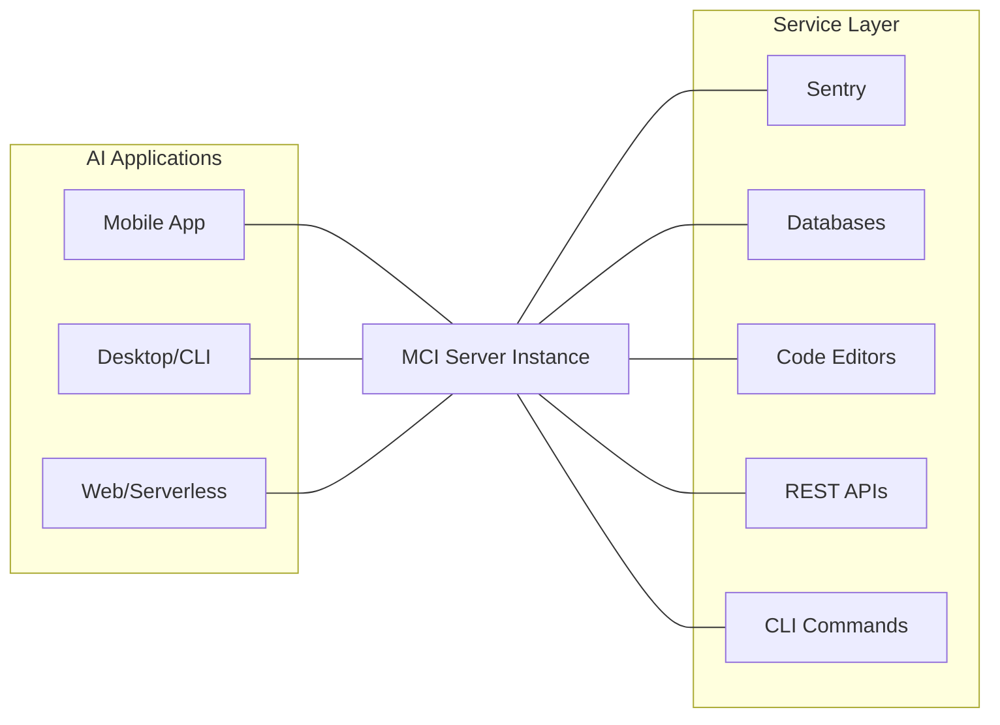
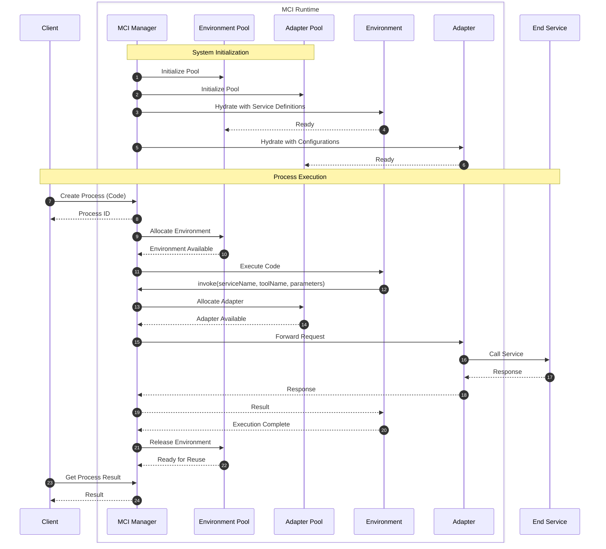

This document provides a comprehensive overview of the **Model Control Interface (MCI)**, covering its operational scope, core concepts, and structural design.

## System Architecture

MCI utilizes a centralized **Client-Proxy-Server** model. By acting as a unified gateway, it eliminates the need for AI applications to manage multiple complex integrations.

## Core Components

### The Client (AI Application)

Clients are the consumers of the architecture. An MCI client can be any interface, ranging from mobile apps to serverless functions, capable of receiving model output and executing HTTP requests.

### The Server (The Proxy)

The MCI Server is the central intelligence of the system. It acts as a proxy, managing authentication, request transformation, and communication between the client and the external environment.

### The Services (The Providers)

These are the functional targets that perform specific tasks or store data.

- **REST Servers:** Traditional web services.
- **Database Engines:** Direct data persistence layers.
- **Execution Environments:** CLI tools, code editors, or message consumers.

## Runtime Building Blocks

MCI coordinates two module types:

1. **Environment Modules:** Isolated runtimes where process code executes.
2. **Adapter Modules:** Protocol bridge modules that connect MCI to end services.

For module types, pooling, hydration, and lifecycle, see [Modules](/modules).

For process creation, lifecycle, timeout behavior, blocking and non-blocking execution, and retrieval endpoints, see [Processes](/processes).

## Asynchronous Client Interaction

From the client perspective, process execution is asynchronous. Clients can create processes and continue without blocking, then retrieve state and outputs later by process ID.

## Sequence Diagram

