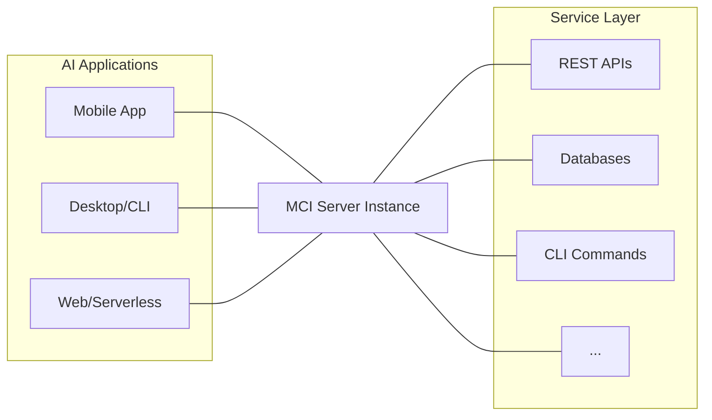
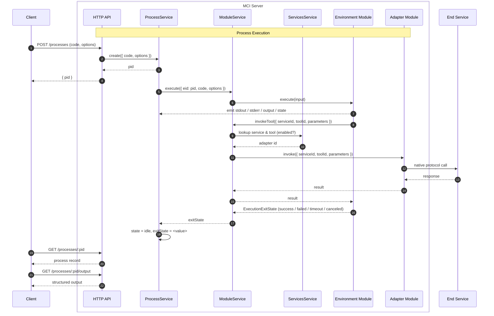

This document describes the runtime shape of the **Model Control Interface
(MCI)** — its components, how they cooperate, and where work runs.

## System Architecture

MCI is a single HTTP server that sits between AI applications (clients) and
the services those applications want to act on. Clients submit code, MCI runs
it inside a sandboxed environment, and tool invocations made from that code
are translated by adapter modules into calls to the real services.

## Core Components

The MCI server is composed of three cooperating services.

### `Processes`

Owns process lifecycle — creating a process from submitted code, scheduling
its execution, tracking state and exit state, and capturing stdout, stderr,
and structured output. Processes have a `pid` and are addressable by clients
through the `/processes` HTTP routes.

See [Processes](/content/processes) for the full process model.

### `Services`

Owns the registry of installed services and their tools — manifest storage,
JSON-Schema-validated configuration, AES-256-GCM-encrypted secrets, install/
update/delete, and enable/disable. Surfaces the `/services` and `/tools`
routes.

See [Services](/content/services) and [Tools](/content/tools).

### `Modules`

Owns the **module registry** and runtime activation. Registers built-in
modules and any custom modules dropped into `$MCI_DATA_DIR/modules/`.
Reconciles the registry with the database (inserting new entries, marking
missing ones as `orphaned`, restoring them when they reappear), and activates
the modules currently enabled.

See [Modules](/content/modules).

### Modules

- **Adapter modules** translate environment tool invocations into the right
  call to the right end service (HTTP, RPC, whatever the service speaks),
  and hold the per-service config and secret snapshots needed to do so.
- **Environment modules** execute submitted code in an isolated runtime and
  expose generated bindings so that code can discover services, fetch tool
  metadata, and invoke tools.

See [Adapter Modules](/content/modules/adapters) and
[Environment Modules](/content/modules/environments).

## Module Activation Model

MCI does not maintain a pool of independent module instances. Instead:

- **Adapters**: every enabled adapter is activated on startup. When a service
  is enabled, MCI builds a `ServiceState` snapshot (manifest +
  `adapterDomain` + config + decrypted secrets) and calls
  `adapter.hydrateService(state)`. Disabling or updating the service calls
  `dehydrateService(serviceId)`.
- **Environments**: at most **one** environment is active at any time. When
  the active environment is replaced (or disabled), it is marked **draining**
  — no new executions are scheduled on it, but in-flight executions finish.
  Once it has no executions left, the runtime tears it down.

This model keeps the running surface small and deterministic: a single source
of truth for "which environment runs new code", plus a known set of adapters
for outbound calls.

## Process Lifecycle

From the client's perspective, process execution is asynchronous. The client
creates a process and either gets a `pid` back immediately, or — with
`block: true` — waits until the process reaches `idle`. Outputs are retrieved
by `pid` from the `/processes/:pid/{output,stdout,stderr}` routes once the
process is idle.

## What Runs Where

| Concern | Owner | Notes |
| --- | --- | --- |
| HTTP, auth, routing | `App` + Express middleware | API key via `Authorization: Bearer …` when `MCI_API_KEY` is set. |
| Process records & I/O capture | `ProcessService` | In-memory. State, exitState, code, output, stdout, stderr. |
| Service / tool registry | `ServicesService` + SQLite (libSQL) | Persistent. Tools are unique by `(serviceId, toolId)`. |
| Module registry & activation | `ModuleService` | Reconciles built-ins and `$MCI_DATA_DIR/modules/` against the DB. |
| Code execution | Active environment module | Default: `typescript-ivm` (`isolated-vm`). |
| Outbound calls to end services | Adapter modules | Default: `openapi`. |
| Secret storage | DB column, AES-256-GCM | Requires `MCI_SECRETS_KEY` (32 bytes, base64). |

For the transport between these pieces — HTTP at the edge, isolate-host
references inside the worker — see [Transport](/content/transport).
