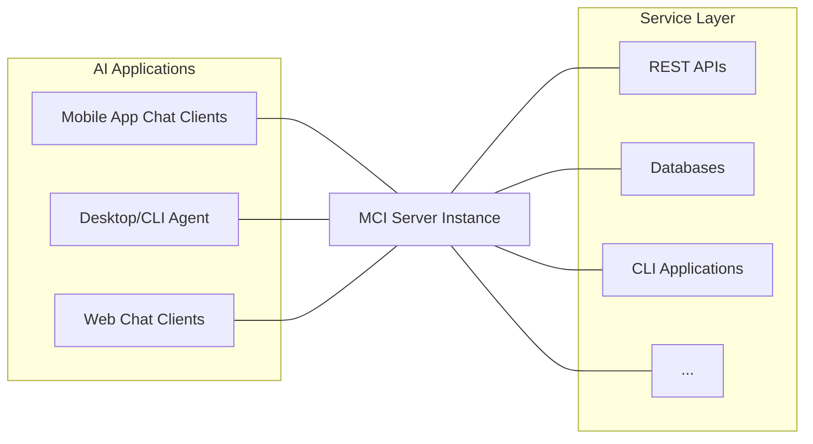
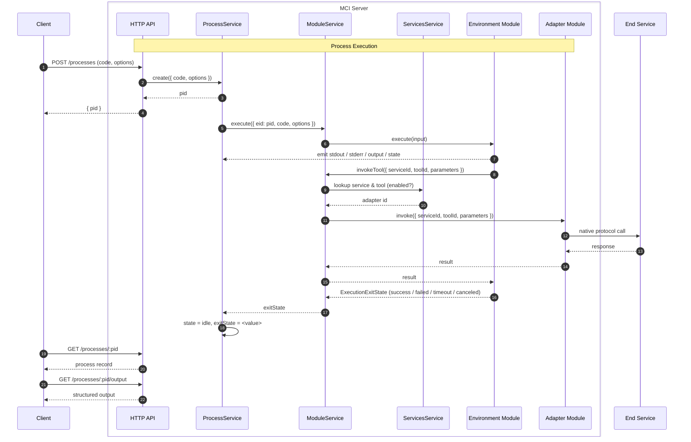

MCI is a single HTTP server that sits between AI applications (clients) and
the services those applications want to act on. Clients submit code, MCI runs
it inside a sandboxed environment, and tool invocations made from that code
are translated by adapter modules into calls to the real services.

## Core Components

The MCI server is composed of three cooperating services.

### `Processes`

Owns process lifecycle, responsible for creating a processes, scheduling and
terminating it's execution, tracking state, and capturing outputs.

See [Processes](/content/processes) for the full process model.

### `Services`

Owns the **service registry**, responsible for installing, updating, and
deleting services services, retrieving service and tool data, and managing
configuration and encrypted secrets.

See [Services](/content/services) and [Tools](/content/tools) for the full
services model.

### `Modules`

Owns the **module registry**, responsible for installing, updating, and
deleting modules, Loading built-in and any custom modules and dispatching
commands to the different module types.

See [Modules](/content/modules) for the full modules model.

The different types of modules play different roles in MCI;

- **Adapter modules**: Generates services and translate tool invocations into
  the right call to the right end service (HTTP, RPC, whatever the service
  speaks), and hold the per-service config and secret snapshots needed to do so.
- **Environment modules** execute submitted code in and expose generated
  bindings so that code can discover services, fetch tool metadata, and invoke
  tools.

See [Adapter Modules](/content/modules/adapters) and
[Environment Modules](/content/modules/environments) for the full models.

This model keeps the running surface small and deterministic: a single source
of truth for "which environment runs new code", plus a known set of adapters
for outbound calls.

## Process Lifecycle

From the client's perspective, process execution is asynchronous. The client
creates a process and either gets a `pid` back immediately, or — with
`block: true` — waits until the process reaches `idle`. Outputs are retrieved
by `pid` from the `/processes/:pid/{output,stdout,stderr}` routes once the
process is idle.

