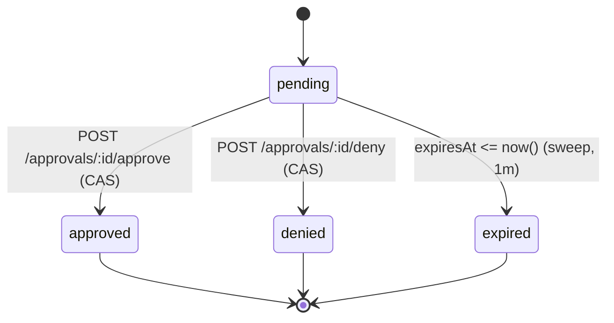

When a tool's effective policy is `ask` (default for unknown tools, or explicitly set), every invocation is parked until an operator decides.

## Lifecycle

- `pending → approved|denied|expired` via single conditional `UPDATE … WHERE state='pending'` (CAS); loser of a concurrent approve/expiry gets `409`.
- `expiresAt` is frozen at creation (`Date.now() + CYRNEL_APPROVAL_TIMEOUT_MS`, default 5 min, `0` invalid). Changing the env var never rewrites in-flight deadlines.
- `approved` resumes the `suspended` process (`pendingApprovalIds` → 0 → `running` with timeout re-arm, `invokeAdapter` then executes); `denied`/`expired` fail the parked call with catchable `__ivmError` (`"Approval denied"` / `"Approval expired"`).
- Terminal rows (`approved|denied|expired`) are retained until `CYRNEL_APPROVAL_RETENTION_MS` (default 30 days, `0` = keep forever, swept hourly on `(state, decidedAt)`), `pending` never pruned. Service deletion bulk-expires its pendings before the FK cascade deletes them.

## Endpoints

| Method | Path | Notes |
| --- | --- | --- |
| `GET` | `/approvals?state=&serviceId=&toolId=&processId=&cursor=&limit=` | `before` on `(createdAt desc, id)`, filters combinable, `state=pending` dominant triage |
| `GET` | `/approvals/:id` | Decrypts `parameters` transiently for the response only |
| `POST` | `/approvals/:id/approve` | Empty body, `409` with current state if not pending |
| `POST` | `/approvals/:id/deny` | Empty body, `409` with current state if not pending |

`parameters` are encrypted at rest via `secrets.util.ts` (`approval_requests.parameters`), never logged (logs only `{event, serviceId, toolId, processId, approvalId, requestId}`), decrypted only inside the approvals controller for `GET` responses.

## Process Interaction

While pending, the invoking process is `suspended` (persisted in `processes.state`, `pendingApprovalIds: string[]` gated behind `state==="suspended"`), excluded from `trimIdleProcesses` and not revivable via `run`. `suspended` is host-only (not an `ExecutionState`/`EnvironmentBindings.setState`); the environment's `ivm.Reference` is kept alive in `refs[]` until approve/deny/expire resolves to `__ivmError`.

On restart, orphaned `suspended` rows are marked `terminated` (with `process_data` `failed` + `completedAt`) so `projectDbProcess` exposes terminal `idle` and `run` requires `force`.

## Observability

Approval lifecycle events (`approval-requested`, `approval-resolved`, `approval-expiry-sweep`, `approval-retention-sweep`, `process-recovery-suspended`) go through `infra/logging` with `{serviceId, toolId, processId, approvalId, requestId}`. Never emit `parameters`.
