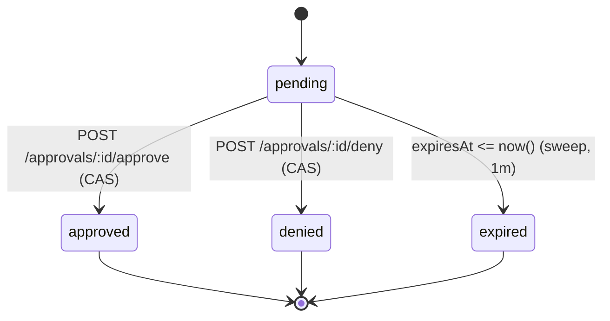

When a tool's effective policy is `ask` (the immutable default when no rule matches, or set by a matching rule), every invocation is parked until an operator decides.

## Lifecycle

- `pending → approved|denied|expired` via single conditional `UPDATE … WHERE state='pending'` (CAS); loser of a concurrent approve/expiry gets `409`.
- `expiresAt` is frozen at creation (`Date.now() + CYRNEL_APPROVAL_TIMEOUT_MS`, default 5 min, `0` invalid). Changing the env var never rewrites in-flight deadlines.
- `approved` resumes the `suspended` process (`pendingApprovalIds` → 0 → `running` with timeout re-arm, `invokeAdapter` then executes); `denied`/`expired` fail the parked call with catchable `__ivmError` (`"Approval denied"` / `"Approval expired"`).
- Terminal rows (`approved|denied|expired`) are retained until `CYRNEL_APPROVAL_RETENTION_MS` (default 30 days, `0` = keep forever, swept hourly on `(state, decidedAt)`), `pending` never pruned. Service deletion bulk-expires its pendings before the FK cascade deletes them.

## Endpoints

| Method | Path | Notes |
| --- | --- | --- |
| `GET` | `/approvals?state=&serviceId=&toolId=&processId=&cursor=&limit=` | `before` on `(createdAt desc, id)`, filters combinable, `state=pending` dominant triage |
| `GET` | `/approvals/:id` | Decrypts `parameters` transiently for the response only |
| `POST` | `/approvals/:id/approve` | Empty body, `409` with current state if not pending |
| `POST` | `/approvals/:id/deny` | Empty body, `409` with current state if not pending |

`parameters` are encrypted at rest via `secrets.util.ts` (`approval_requests.parameters`), never logged (logs only `{event, serviceId, toolId, processId, approvalId, requestId}`), decrypted only inside the approvals controller for `GET` responses.

## Process Interaction

While pending, the invoking process is `suspended` (persisted in `processes.state`, `pendingApprovalIds: string[]` gated behind `state==="suspended"`), excluded from `trimIdleProcesses` and not revivable via `run`. `suspended` is host-only (not an `ExecutionState`/`EnvironmentBindings.setState`); the environment's `ivm.Reference` is kept alive in `refs[]` until approve/deny/expire resolves to `__ivmError`.

On restart, orphaned `suspended` rows are marked `terminated` (with `process_data` `failed` + `completedAt`) so `projectDbProcess` exposes terminal `idle` and `run` requires `force`.

## MCP Transport

The MCP server (`@cyrnel/mcp`) is only a presentation layer over the endpoints
above; it never decides policy itself. `CYRNEL_MCP_APPROVAL_METHOD` selects how a
pending approval reaches the client:

| Method | Behavior |
| --- | --- |
| `elicitation` (default) | `create_process` / `run_process` with `block=true` poll the process, and on `suspended` with pending approvals issue one `elicitation/create` per approval (client must advertise `elicitation: { form: {} }`), then `POST` the decision and resume polling. Sequential and repeated rounds handle both simultaneous and successive approvals within one logical tool call. |
| `manual` | Adds the `list_pending_approvals`, `approve_approval`, and `deny_approval` tools. Blocking calls return the `suspended` process with `pendingApprovalIds` so the model decides explicitly. |

Decision mapping in `elicitation` mode: `accept` with `approved: true` approves; `accept` with `approved: false`, `decline`, and `cancel` all deny, so a refusal unblocks the process immediately instead of parking until `expiresAt`.

The elicitation payload carries only a boolean, so a client response can never name an approval id — which record a decision applies to is fixed by the server before the request is sent. Approval parameters are redacted (secret-looking keys, depth, and length bounded) before they appear in a prompt.

If a prompt goes unanswered, the in-band presenter is bounded by `APPROVAL_WAIT_BUDGET_MS` (25s in `apps/mcp/src/process.ts`), and the tool call returns the current process state and pending approval ids; nothing is auto-approved or auto-denied. The budget must stay below the MCP client's own request timeout: if the client gave up first it would lose the process id along with the response and orphan the process. An abandoned prompt is deliberately left in flight, so a late answer still resolves the approval through the API, and its rejection is absorbed so it cannot surface as an unhandled rejection.

`suspended` is not by itself an approval: the wait loop only acts when pending approval records exist, so an unrelated future suspension is left untouched.

Three budgets are tracked separately and must not be collapsed into one number: the process execution deadline (`timeout` seconds → `timeoutMs`), the ceiling for a non-approval suspension (10 min), and the per-prompt budget above. Time a human spends answering is excluded from the first two — it is neither the process running nor a stalled wait — so a slow decision never consumes the execution budget.

## Observability

Approval lifecycle events (`approval-requested`, `approval-resolved`, `approval-expiry-sweep`, `approval-retention-sweep`, `process-recovery-suspended`) go through `infra/logging` with `{serviceId, toolId, processId, approvalId, requestId}`. Never emit `parameters`. The MCP layer logs `mcp-approval-decided` with `{processId, approvalId, serviceId, toolId, action, approved, outcome}` and never logs parameters.
