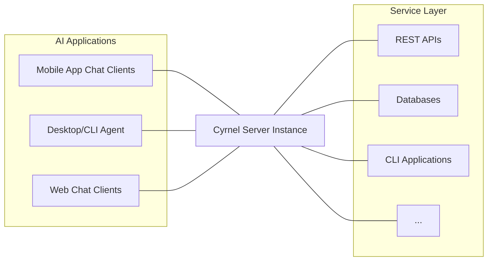
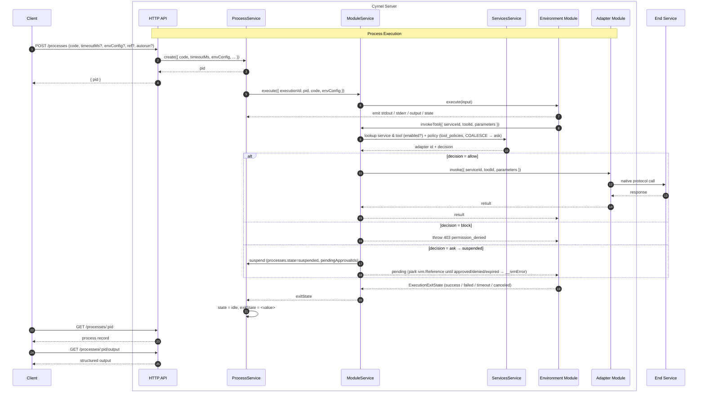

Cyrnel is a single HTTP server that sits between AI applications (clients) and
the services those applications want to act on. Clients submit code, cyrnel runs
it inside a sandboxed environment, and tool invocations made from that code
are translated by adapter modules into calls to the real services.

## Core Components

The cyrnel server is composed of three cooperating services.

### `Processes`

Owns process lifecycle, responsible for creating processes, scheduling and
terminating their execution, tracking state, and capturing outputs.

See [Processes](/cyrnel/docs/v1/processes) for the full process model.

### `Services`

Owns the **service registry**, responsible for installing, updating, and
deleting services, retrieving service and tool data, and managing
configuration and encrypted secrets. It also owns owner-scoped
**credentials** (OAuth clients, per-`(service, scheme)` credential slots,
and the `CredentialProvider` that resolves `(service, scheme)` →
credential on demand, with on-demand refresh plus a background sweep).

See [Services](/cyrnel/docs/v1/services) and [Tools](/cyrnel/docs/v1/tools) for the full
services model, and [Authentication](/cyrnel/docs/v1/authentication) for the auth operator guide.

### `Modules`

Owns the **module registry**, responsible for installing, updating, and
deleting modules, Loading built-in and any custom modules and dispatching
commands to the different module types.

See [Modules](/cyrnel/docs/v1/modules) for the full modules model.

The different types of modules play different roles in cyrnel;

- **Adapter modules**: Generate services and translate tool invocations into
  the right call to the right end service (HTTP, RPC, whatever the service
  speaks), holding the live per-service runtime and resolving the config,
  secrets, and credentials needed to do so on demand.
- **Environment modules** execute submitted code and expose generated
  bindings so that code can discover services, fetch tool metadata, and invoke
  tools.

See [Adapter Modules](/cyrnel/docs/v1/adapters-modules) and
[Environment Modules](/cyrnel/docs/v1/environments-modules) for the full models.

This model keeps the running surface small and deterministic: a single source
of truth for "which environment runs new code", plus a known set of adapters
for outbound calls.

## Process Lifecycle

From the client's perspective, process execution is asynchronous. The client
creates a process and either gets a `pid` back immediately, or, with
`block: true`, waits until the process reaches `idle`. Outputs are retrieved
by `pid` from the `/processes/:pid/{output,stdout,stderr}` routes once the
process is idle.

