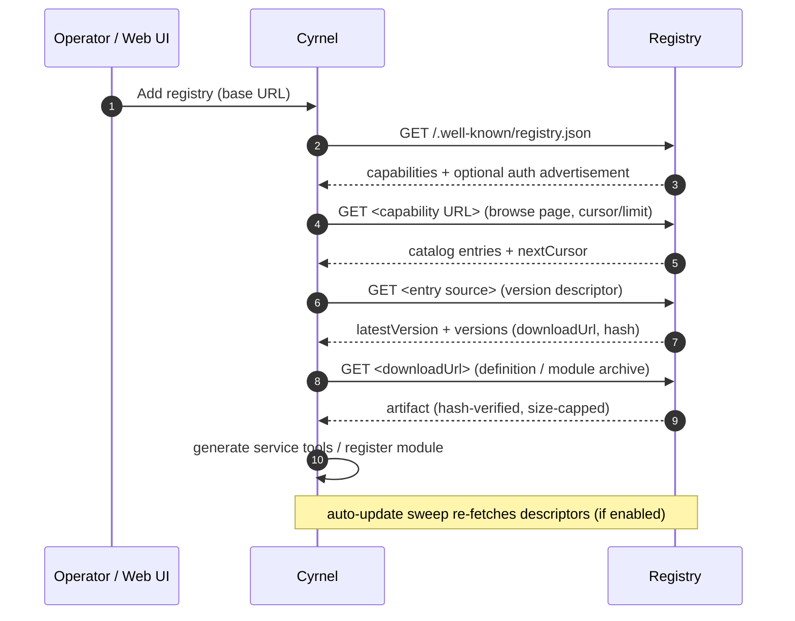

A Cyrnel registry is a **read-only HTTP server** that distributes two kinds
of content:

- **Definitions**: machine-readable service definitions (today: OpenAPI
  3.0 documents) that adapters turn into installable services with tools.
- **Modules**: distributable archives of adapter and environment modules
  (zstd-compressed tars) that extend what Cyrnel can run and reach.

Think of it as a package repository (like npm's registry) for Cyrnel: a
Cyrnel server discovers a registry, browses its catalog, downloads
artifacts with hash verification, and periodically checks them for newer
versions. A registry never receives writes - it is a passive content
server.

## Roles

- **Registry authors** build and host registries. This specification is
  for them: the well-known document, catalog page formats, version
  descriptors, artifact formats, pagination, and auth.
- **Operators** run Cyrnel and point it at registries. The management
  surface is covered in [Manage registries](/cyrnel/docs/registries) and
  [Registry management API](/cyrnel/registry-specs/registry-management-api).

## Capabilities

A registry advertises its content through a
[well-known document](/cyrnel/registry-specs/well-known) with capability
keys:

| Capability | Version (current) | Provides |
| --- | --- | --- |
| `definitions.v1` | `1` | Catalog of service definitions + per-definition version descriptors |
| `modules.v1` | `1` | Catalog of adapter/environment modules + per-module version descriptors |

Cyrnel negotiates the **highest supported version** of each capability it
understands; a registry may advertise future versions (e.g. `modules.v2`)
that Cyrnel silently skips. A registry can offer one, both, or neither
capability - an entry pointing at a registry with no supported capability
is rejected at add time.

## How Cyrnel consumes a registry

## The contract in one line

A registry must serve: a well-known document at `/.well-known/registry.json`,
capability browse pages, per-entry version descriptors, and downloadable,
hash-verified artifacts - all under the egress, size, and integrity
constraints documented here.

## What a registry is not

- **Not an API.** Cyrnel only fetches; there is no "register with me" or
  push channel from Cyrnel to the registry.
- **Not a source of truth for state.** Installed services and modules are
  snapshotted locally; the registry is only consulted on install and
  update.
- **Not required to know about Cyrnel.** A registry never needs to know
  who its consumers are, and requires no Cyrnel-side user agent. It can be
  served by any static file server or CDN - see
  [Building a registry](/cyrnel/registry-specs/building-a-registry).