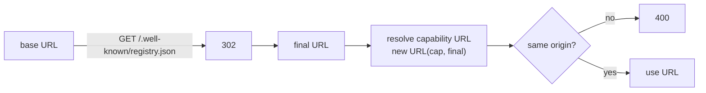

Every registry must serve a JSON document at
`GET /.well-known/registry.json` that advertises **who it is** and
**what capabilities it offers**. Cyrnel fetches this URL whenever a
registry is added, refreshed, or authenticated - capability URLs are
resolved **against the post-redirect final URL**, so a redirect must
point at a host that can serve the same capabilities.

## Shape

```json
{
  "id": "my-registry",
  "definitions.v1": { "url": "/definitions/v1", "security": [] },
  "modules.v1": "/modules/v1",
  "auth": {
    "schemes": {
      "apiKey": { "type": "apiKey", "in": "header", "paramName": "X-Key" },
      "basic": { "type": "basic" },
      "bearer": { "type": "http", "scheme": "bearer" },
      "oauth2": {
        "type": "oauth2",
        "grantTypes": ["authorization_code", "client_credentials"],
        "authorizationUrl": "https://my-registry.example/authorize",
        "tokenUrl": "https://my-registry.example/oauth/token",
        "scopes": { "read": "Read catalog" },
        "tokenPlacement": { "in": "header", "paramName": "Authorization", "prefix": "Bearer" }
      }
    },
    "security": [{ "oauth2": ["read"] }]
  }
}
```

### `id`

**Required.** The registry's identity - a slug matching
`^[A-Za-z0-9_-]+$`. It is used as the default stored registry id (an
operator may override it when adding the registry, but the advertised
`id` is still required and validated).

### Capability keys

Keys matching `^(definitions|modules)\.v(\d+)$` advertise a capability
and its highest offered version mean different things:

| Key pattern | Value |
| --- | --- |
| `definitions.v<N>` | Capability target: a non-empty string URL (absolute or relative) inheriting the global `auth.security`, **or** `{ "url": "<url>", "security"?: [...] }` overriding it per capability (`[]` = public) |
| `modules.v<N>` | Same shape as `definitions.v<N>` |

Cyrnel supports version `1` of each capability. Version negotiation:

- All advertised keys are collected; only those whose numeric version is
  supported (`1`) are candidates.
- The **highest** supported version wins. A registry advertising
  `definitions.v1` and `definitions.v3` gets treated as `v1`.
- A capability whose versions are all unsupported (e.g. only
  `definitions.v9`) resolves to **absent**: browsing that capability
  fails with `404 Registry '<id>' does not support definitions.`, not an
  error about the version number.

### Unknown keys

Keys other than `id`, the two capability patterns, and `auth` are
**silently ignored**.

<Info>
  Add your own metadata freely - old Cyrnel servers won't reject your
  document, and new Cyrnel servers ignore keys they don't know. This is a
  forward-compatibility guarantee.
</Info>

### `auth` (optional)

Advertises the authentication methods the registry accepts, using the
same `AuthDefinition` shape as services (`schemes` map + `security`
requirements). It is **advisory**: it never makes a registry mandatory
to authenticate to, but it tells Cyrnel what it may use. If present it
must be an object with at least one scheme; a non-object `auth` is a
`400`. See [Authentication](/cyrnel/registry-specs/v1/authentication).

```json
{
  "schemes": {
    "apiKey": { "type": "apiKey", "in": "header", "paramName": "X-Key" },
    "oauth2": {
      "type": "oauth2",
      "grantTypes": ["authorization_code", "client_credentials"],
      "authorizationUrl": "https://my-registry.example/authorize",
      "tokenUrl": "https://my-registry.example/oauth/token",
      "scopes": { "read": "Read catalog" },
      "tokenPlacement": { "in": "header", "paramName": "Authorization", "prefix": "Bearer" }
    }
  },
  "security": [{ "oauth2": ["read"] }]
}
```

Rules:

- `auth.schemes` uses the same `AuthScheme` union as the SDK
  (`apiKey` / `basic` / `http`-bearer / `oauth2`). At least one scheme
  is required. Query-parameter API keys are not supported
  (`"in"` must be `"header"`).
- `auth.security` is the global default `SecurityRequirements`
  (OR-of-AND groups), enforced on all authenticated registry requests
  (capability pages, downloads). The well-known document itself stays
  public.
- **Per-capability override:** a capability value may be a plain URL
  string (inherits the global `security`) or `{ "url", "security"? }`
  (overrides it; `"security": []` makes that capability public while
  the rest stays guarded).
- Registry `oauth2` supports both `authorization_code` (human Sign in,
  resolved against shared `oauth_clients` like services) and
  `client_credentials` (machine secret stored per registry). A scheme
  advertising only unsupported grants is recorded as `unsupported`.
- Capability URLs and the `oauth2` `tokenUrl` / `authorizationUrl`
  must share the well-known origin (same-origin guard).

<Warning>
  The old single-method shape (`{ "type": "apiKey", "name": ... }` or
  `{ "type": "oauth2", "grantType": "client_credentials",
  "tokenEndpoint": ..., "scopes": [{ "id", ... }] }`) is **removed,
  not deprecated**. Documents advertising it fail with a `400`
  pointing at this migration. Re-publish using the `schemes` +
  `security` shape above.
</Warning>

## Redirects

Cyrnel follows well-known redirects manually and re-validates every hop:

- Up to **5** redirects; more yields `502 Registry '<id>' redirected too many times.`
- A `3xx` without a `Location` header yields `502` (a `304` is treated the
  same way). Redirects to IP literals, invalid URLs, or non-http(s) targets
  yield `502` (IP literals skip DNS filtering, so the URL itself is validated).
- Each hop re-runs the egress (SSRF) guard and re-applies any configured
  credentials scoped to that host. Auth is recomputed per hop, never forwarded
  cross-origin.
- The **final URL** becomes the base for resolving capability URLs. If a
  capability URL resolves to a different origin than the final URL, Cyrnel
  rejects it with `400 '<url>' must resolve to the same origin as the
  registry.`



## Errors

Well-known fetch errors surface as:

| Status | Condition / message |
| --- | --- |
| `400` | `well-known registry returned invalid JSON.` |
| `400` | `Registry id '<id>' must be a slug ...` (missing/empty/non-slug `id`) |
| `400` | `auth` is present but not an object, has no schemes, or uses the removed single-method shape (`type`/`grantType`/`tokenEndpoint` at the top level — re-publish with `schemes` + `security`) |
| `400` | Capability key value is neither a non-empty string nor a `{ url, security? }` object |
| `502` | Non-2xx upstream status: `well-known registry responded with status <status>.` |
| `502` | `336 redirected too many times.` / redirect missing `Location` |
| `502` | Egress guard failures (DNS, blocked, non-unicast, timeout, oversized) |

Unsupported `auth.schemes` entries are **not** an error - they are recorded as
"unsupported" and ignored until a credential setup actually needs them (which
then fails with a `400`).

## Stored state

On add, Cyrnel stores the registry's id, normalized base URL, and the
discovery advertisement's implication (which capabilities exist, with
their effective `security`). `POST /registries` returns the stored
record plus the advertised `auth` declaration and per-scheme
`resolvedClients` so the UI can render Sign in immediately. A
`POST /registries/:id/refresh` re-fetches the well-known document, stamps
`lastSyncedAt`, and runs auth drift detection - but it does **not**
re-negotiate capability versions or change stored credentials.
