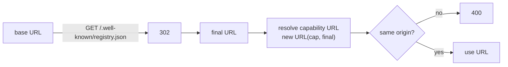

Every registry must serve a JSON document at
`GET /.well-known/registry.json` that advertises **who it is** and
**what capabilities it offers**. Cyrnel fetches this URL whenever a
registry is added, refreshed, or authenticated - capability URLs are
resolved **against the post-redirect final URL**, so a redirect must
point at a host that can serve the same capabilities.

## Shape

```json
{
  "id": "my-registry",
  "definitions.v1": "/definitions/v1",
  "modules.v1": "/modules/v1",
  "auth": {
    "type": "oauth2",
    "grantType": "client_credentials",
    "tokenEndpoint": "https://my-registry.example/oauth/token",
    "scopes": [
      { "id": "definitions:read", "description": "Read registry definitions" },
      { "id": "modules:read", "description": "Read registry modules" }
    ]
  }
}
```

### `id`

**Required.** The registry's identity - a slug matching
`^[A-Za-z0-9_-]+$`. It is used as the default stored registry id (an
operator may override it when adding the registry, but the advertised
`id` is still required and validated).

### Capability keys

Keys matching `^(definitions|modules)\.v(\d+)$` advertise a capability
and its highest offered version mean different things:

| Key pattern | Value |
| --- | --- |
| `definitions.v<N>` | Non-empty string URL (absolute or relative) of the definitions browse page |
| `modules.v<N>` | Non-empty string URL (absolute or relative) of the modules browse page |

Cyrnel supports version `1` of each capability today. Version negotiation:

- All advertised keys are collected; only those whose numeric version is
  supported (`1`) are candidates.
- The **highest** supported version wins. A registry advertising
  `definitions.v1` and `definitions.v3` gets treated as `v1`.
- A capability whose versions are all unsupported (e.g. only
  `definitions.v9`) resolves to **absent**: browsing that capability
  fails with `404 Registry '<id>' does not support definitions.`, not an
  error about the version number.

### Unknown keys

Keys other than `id`, the two capability patterns, and `auth` are
**silently ignored**.

<Info>
  Add your own metadata freely - old Cyrnel servers won't reject your
  document, and new Cyrnel servers ignore keys they don't know. This is a
  forward-compatibility guarantee.
</Info>

### `auth` (optional)

Advertises an optional authentication method. It is **advisory**: it
never makes a registry mandatory to authenticate to, but it tells Cyrnel
what it may use. If present it must be an object; a non-object `auth` is a
`400`. See [Authentication](/cyrnel/registry-specs/authentication).

```json
{ "type": "apiKey", "name": "X-Registry-Key" }
```

or

```json
{
  "type": "oauth2",
  "grantType": "client_credentials",
  "tokenEndpoint": "https://my-registry.example/oauth/token",
  "scopes": [{ "id": "read", "description": "Read access" }]
}
```

## Redirects

Cyrnel follows well-known redirects manually and re-validates every hop:

- Up to **5** redirects; more yields `502 Registry '<id>' redirected too many times.`
- A `3xx` without a `Location` header yields `502` (a `304` is treated the
  same way).
- Each hop re-runs the egress (SSRF) guard and re-applies any configured
  credentials scoped to that host.
- The **final URL** becomes the base for resolving capability URLs. If a
  capability URL resolves to a different origin than the final URL, Cyrnel
  rejects it with `400 '<url>' must resolve to the same origin as the
  registry.`



## Errors

Well-known fetch errors surface as:

| Status | Condition / message |
| --- | --- |
| `400` | `well-known registry returned invalid JSON.` |
| `400` | `Registry id '<id>' must be a slug ...` (missing/empty/non-slug `id`) |
| `400` | Capability key value is not a non-empty string |
| `400` | `auth` is present but not an object |
| `502` | Non-2xx upstream status: `well-known registry responded with status <status>.` |
| `502` | `336 redirected too many times.` / redirect missing `Location` |
| `502` | Egress guard failures (DNS, blocked, non-unicast, timeout, oversized) |

Unsupported `auth.type` values are **not** an error - they are recorded as
"unsupported" and ignored until a setup request actually needs them (which
then fails with a `400`).

## Stored state

On add, Cyrnel stores the registry's id, normalized base URL, and the
discovery advertisement's implication (which capabilities exist). A
`POST /registries/:id/refresh` re-fetches the well-known document, stamps
`lastSyncedAt`, and runs auth drift detection - but it does **not**
re-negotiate capability versions or change stored auth.