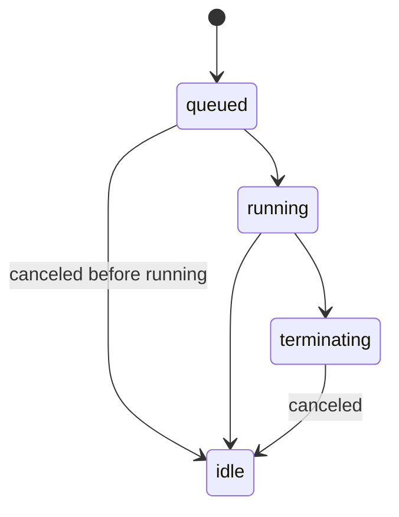

This page collects the execution-related shapes and state machine that
sit between the host and an environment module.

## `ExecutionInput` and `ExecutionOptions`

```ts
interface ExecutionInput {
  eid: number;
  code: string;
  options?: ExecutionOptions;
}

interface ExecutionOptions {
  timeoutMs: number;
}
```

What the host hands to `EnvironmentModule.execute`:

- `eid` is the execution id. **It is the same number as the process
  `pid`.** Treat it as opaque; just feed it back to every binding.
- `code` is exactly what the client submitted via `POST /processes`.
- `options.timeoutMs` is set by the host. It's already resolved against
  `DEFAULT_EXECUTION_TIMEOUT_MS` (`30000`) when the client omits it. The
  environment should treat this as authoritative.

The host **may** pass an undefined `options` if no defaults are
configured. Environments should fall back to their own default in that
case.

## Host-side States

The host's `ProcessService` runs the public-facing state machine. From
the API's perspective, a process is always in one of four states:



- `idle`: Not executing. Either pre-run, or post-run with an exit state.
- `queued`: Accepted, waiting for the environment.
- `running`: Environment is executing the code.
- `terminating`: A kill is in flight.

## Environment-reported States

`EnvironmentBindings.setState(eid, data)` accepts only the environment
states:

```ts
const EXECUTION_STATES = ["queued", "running"] as const;
type ExecutionState = "queued" | "running";
```

The host maps these to its own state machine. `idle` and `terminating`
are host-only; the environment never reports them.

## Exit States

```ts
const EXECUTION_EXIT_STATES = [
  "failed",
  "success",
  "timeout",
  "canceled",
] as const;
type ExecutionExitState = "failed" | "success" | "timeout" | "canceled";
```

The environment's `execute` returns one of these. The host stores it as
`process.exitState`:

| Exit | When |
| --- | --- |
| `success` | The code completed normally. |
| `failed` | The code threw, or the environment couldn't run it. `process.error` is populated. |
| `timeout` | The environment terminated the execution because it exceeded `options.timeoutMs`. |
| `canceled` | The host called `kill(eid)`, or the environment is shutting down. |

The host also accepts `null` as a transient pre-execution value, but
**environment code never returns null**.

## Timeout Contract

The host hands the environment a `timeoutMs` and expects the environment
to enforce it. The host does not run a wall clock of its own; if the
environment lies about exit state, the process record lies too.

- The bundled `typescript-ivm` enforces the timeout by racing the
  isolate against a `setTimeout`, then disposing the isolate.
- Custom environments are free to use any mechanism, process group
  signals, worker thread interrupts, whatever fits the runtime.

## Cancellation Contract

`EnvironmentModule.kill(eid)` is the only way the host asks for
cancellation. The environment should:

1. Stop whatever is executing for `eid` promptly.
2. Resolve the outstanding `execute(eid)` promise with `"canceled"`.
3. Be safe to call with an `eid` it does not know about.

There is no "soft kill" channel. If you need cooperative shutdown for
long-running tools, model it inside the runtime (e.g. an
`AbortController` exposed to user code).

## What the host owns

| Concern | Owner |
| --- | --- |
| Generating `eid` / `pid` | Host (`ProcessService.createPid`). |
| Default `timeoutMs` | Host (`DEFAULT_EXECUTION_TIMEOUT_MS`). |
| stdout/stderr decoding | Host (`StringDecoder("utf8")` per stream). |
| Output merging | Host (`Object.assign(process.output, data)`). |
| `state` transitions to `idle` / `terminating` | Host. |
| Routing tool invocations to adapters | Host (`ModuleService.invoke`). |

## What the environment owns

| Concern | Owner |
| --- | --- |
| Transpiling / parsing `input.code` | Environment. |
| Running the code in a sandbox | Environment. |
| Enforcing `timeoutMs` | Environment. |
| Reporting `queued` / `running` / exit state | Environment. |
| Emitting stdout, stderr, output | Environment. |
| Surfacing tool calls from user code back through `bindings.invokeTool` | Environment. |
