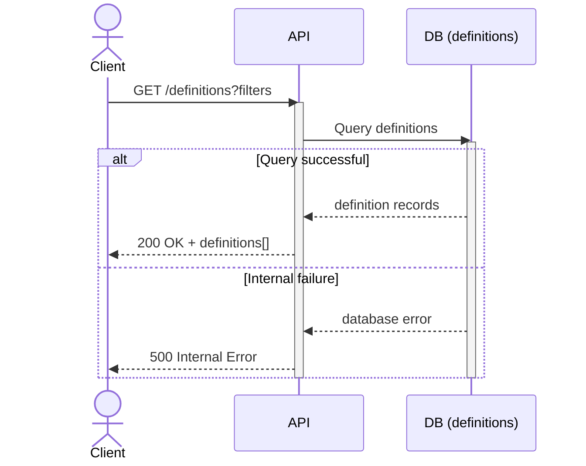
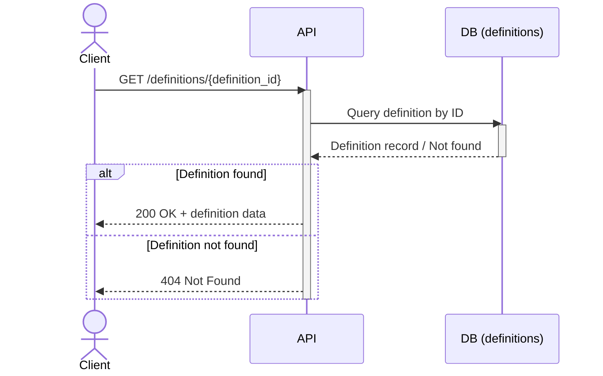

```mermaid
sequenceDiagram
    actor Client
    participant API
    participant DB
    participant S3_Definitions as S3 (definitions)

    Client->>API: POST /definitions (definition data)
    activate API

    API->>DB: Check if definition_id exists
    activate DB
    DB-->>API: Exists / Not Exists
    deactivate DB

    alt Definition already exists
        API-->>Client: 409 Conflict
    else Definition does not exist

        API->>DB: Insert definition metadata (enabled=false)
        activate DB
        DB-->>API: Insert result
        deactivate DB

        alt DB insert fails
            API-->>Client: 500 Internal Error
        else Insert succeeds

            API->>S3_Definitions: Upload definition file
            activate S3_Definitions

            alt S3 upload fails
                S3_Definitions-->>API: Upload error
                deactivate S3_Definitions

                API->>DB: Delete inserted definition
                activate DB
                DB-->>API: Delete confirmation
                deactivate DB

                API-->>Client: 500 Storage Error

            else Upload succeeds
                S3_Definitions-->>API: Upload confirmation
                deactivate S3_Definitions
                API-->>Client: 201 Created + definition
            end
        end
    end

    deactivate API
```