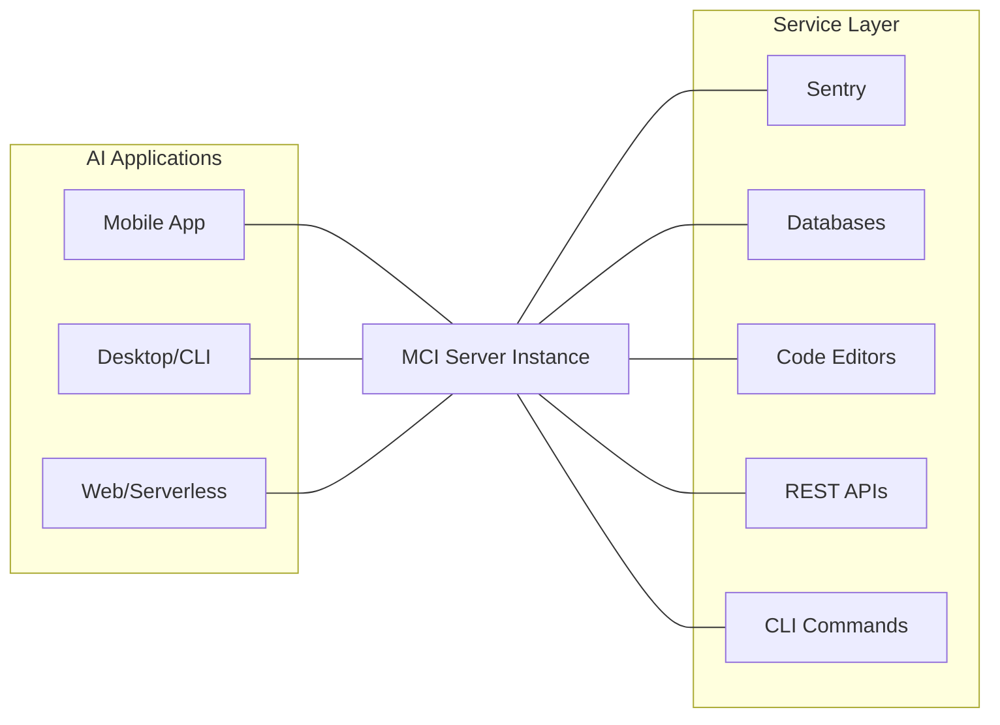
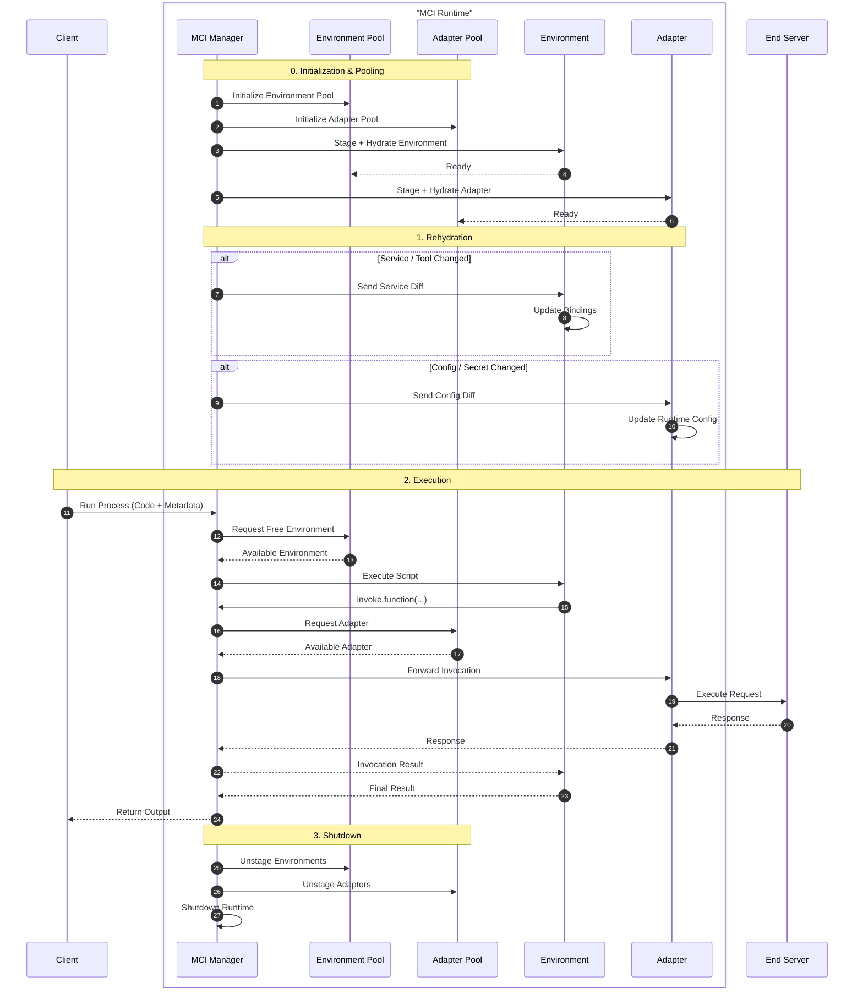

This document provides a comprehensive overview of the **Model Control Interface (MCI)**, covering its operational scope, core concepts, and structural design.

## System Architecture

MCI utilizes a centralized **Client-Proxy-Server** model. By acting as a unified gateway, it eliminates the need for AI applications to manage multiple complex integrations.

## Core Components

### **The Client (AI Application)**

Clients are the "consumers" of the architecture. An MCI client can be any interface, ranging from mobile apps to serverless functions, capable of receiving model output and executing HTTP requests.

### **The Server (The Proxy)**

The MCI Server is the central intelligence of the system. It acts as a **Proxy**, managing authentication, request transformation, and communication between the Client and the external environment.

### **The Service (The Providers)**

These are the functional targets that perform specific tasks or store data.

- **REST Servers:** Traditional web services.
- **Database Engines:** Direct data persistence layers.
- **Execution Environments:** CLI tools, code editors, or message consumers.

## How It Works: The Execution Life-cycle

**MCI** is the "brain" of the operation, It manages the environment and coordinates five distinct types of modules to process the request:

| **Module Type** | **Primary Function** |
| --- | --- |
| **Environment** | The secure, isolated environment (container/VM) where the script is executed. |
| **Adapter** | Acts as the proxy to specific protocols (REST, GraphQL, gRPC). It receives requests from dispatches and relays them to the end service. |

### 0. Initialization

**Module Pooling**: Environment and adapter modules are loaded into pools based on pooling settings. Pooling is done in order to cut down idle time for processes. The pooling process involves initializing an instance of the given module into a staging area, hydrating them and unstaging them.

### 1. Staging & Hydration

The staging and hydration processes are constructively run every time a module is initialized or a change in a service is made. Hydration works differently for each pool-able module type.

- Environment modules are hydrated when there is a change in a service or tool. whenever a change is detected, the diff of the changes are fed to the environment to update its internal duplicate of the service and re-generate bindings to interact with them from code.
- Adapter modules are hydrated when there is a change to the services configuration or secrets. Just as with environment, the change diff is passed for the adapter to update its internal double of the data. This data would be used when a tool invoke is received for that service.

### 2. Execution

When MCI receives instruction to run a process, it takes the processes code and passed it to a free environment for execution as well as use metadata for the process like timeout and reference to decide how the process is run and how to identify the process.

The environment executes the code. When the script calls a function (e.g. `invoke.shell.exec({ ... })`), the request is routed to **MCI Server**, through any possible, **Interceptors** to the **adapter** and finally to the end server. The response follows the same path back, allowing the script to either pipe the data into another action or return the final result to the Client.

